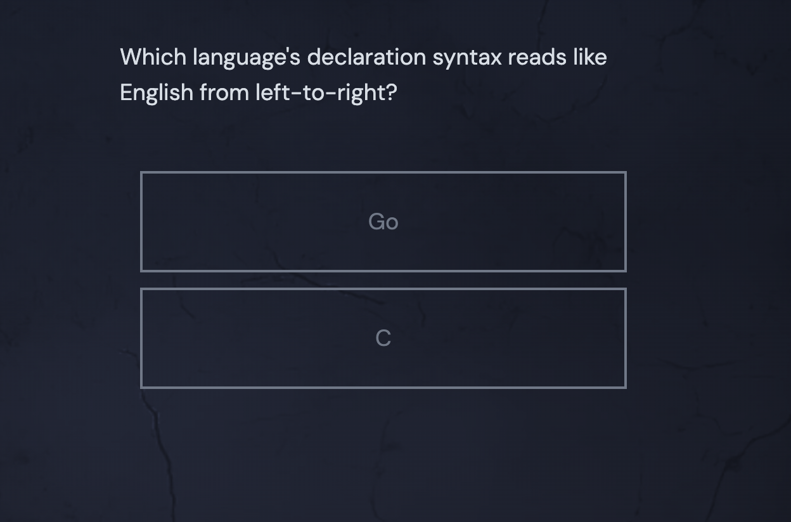
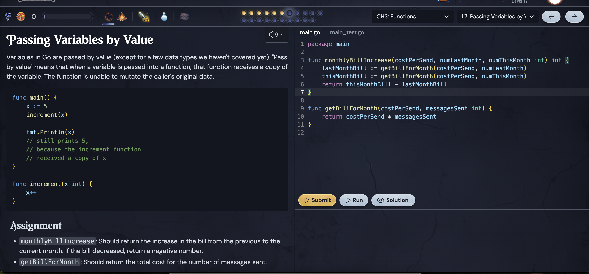

## The not so good

### The submissions are subject to cheating 

1. The search example 

2. The semantic chunking example:

Expects:

```
uv run cli/semantic_search_cli.py semantic_chunk "First sentence here. Second sentence here. Third sentence here. Fourth sentence here." --max-chunk-size 2 --overlap 1
Expecting exit code: 0
Expecting stdout to contain all of:
Semantically chunking 85 characters
First sentence here. Second sentence here.
Second sentence here. Third sentence here.
Third sentence here. Fourth sentence here.
```

This passes, which it shouldn't. This can cause issues down the line.

```
Semantically chunking 85 characters
1. First sentence here. Second sentence here.
2. Second sentence here. Third sentence here.
3. Third sentence here. Fourth sentence here.
4. Fourth sentence here.
```

## Compilation and submission time

Can someones take 10s> to get an answer to a very simple question.





